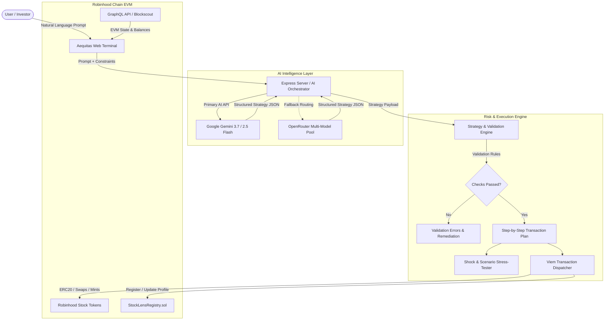

# Aequitas Protocol (RWA Agent)
### Autonomous AI-Powered Stock Token Strategy & Portfolio Balancing Protocol on Robinhood Chain

[-ADF802?style=for-the-badge&logo=ethereum&logoColor=black)](https://explorer.testnet.chain.robinhood.com)
[](https://react.dev)
[](https://www.typescriptlang.org/)
[](https://ai.google.dev/)
[](https://viem.sh)
[](LICENSE)

---

## 📌 Executive Summary

**Aequitas Protocol** is an institutional-grade, autonomous Real-World Asset (RWA) intelligence and execution protocol designed specifically for **Robinhood Chain** (EVM Chain ID `4663` Mainnet / `46630` Testnet). 

It empowers users to turn **natural language financial objectives** into mathematically optimized stock token strategies, real-time portfolio rebalancing workflows, Monte Carlo stress-test simulations, and non-custodial onchain EVM transactions with automated risk safeguards.

---

## 🚀 Key Features

### 1. 🤖 Natural Language AI Strategy Synthesizer
- **Conversational Strategy Generation**: Converts user prompts (e.g., *"Invest $5,000 into AI infrastructure and semiconductors with max 30% per asset and defensive ETF hedging"*) into structured mathematical allocations.
- **Multi-Model Intelligence**: Powered by **Google Gemini 3.7 / 2.5 Flash** (via `@google/genai` SDK) with robust fallback routing through **OpenRouter** (Claude 3.5 Haiku, Llama 3.3 70B, DeepSeek).
- **Interactive Financial Copilot ("Ask Aequitas")**: Provides quantitative answers regarding portfolio sensitivity, beta exposure, and hypothetical macroeconomic shifts without giving unsolicited financial advice.

### 2. ⚖️ Autonomous Portfolio Rebalancer
- **Target vs. Current Allocation Matrix**: Analyzes current onchain token balances against active target strategies.
- **Delta Computation & Action Planner**: Automatically calculates exact buy/sell amounts, token quantities, and slippage tolerances needed to bring a portfolio into equilibrium.
- **One-Click Rebalance Transmutation**: Turn rebalancing adjustments into executable onchain transaction batches.

### 3. 🛡️ Onchain Constraint & Safety Validation Engine
- **Mathematical Invariants**: Enforces strict mathematical rules (allocations must sum to exactly 100%, single asset caps, non-zero allocations, valid token contract whitelisting).
- **Gas & Liquidity Checks**: Verifies native ETH gas availability and capital sufficiency before allowing execution.
- **Live / Demo Mode Switcher**: Practice and simulate strategies risk-free using a simulated high-fidelity demo environment, or execute live transactions on Robinhood Chain using any injected Web3 wallet (MetaMask, Coinbase Wallet, Rabby, etc.).

### 4. 📊 Portfolio Health & Risk Intelligence
- **Composite Health Score (0–100)**: Evaluates portfolio quality across diversification, concentration, asset count, and volatility/beta exposure.
- **Automated Risk Signals**: Highlights high-concentration warnings, sector over-exposure alerts, and volatility outliers.
- **Interactive Visualizations**: Real-time performance curves, asset allocation donuts, and sector breakdown powered by Recharts.

### 5. ⚡ Scenario Stress-Testing & Shock Simulator
- **Dynamic Macro Shocks**: Simulate custom price shocks (-50% to +50%) on individual assets or entire sectors.
- **Instant PnL Forecasting**: View immediate dollar and percentage portfolio impacts under hypothetical market crashes, tech selloffs, or broad-market rallies.

### 6. 📜 Onchain Identity (`StockLensRegistry.sol`)
- **Decentralized Profile Registry**: Register and manage onchain portfolio handles and identity records directly on the Robinhood Chain smart contract.
- **Verifiable Strategy Metadata**: Store and retrieve profile metadata onchain with Blockscout explorer verification.

### 7. 🌐 Full GraphQL & REST API Suite
- **GraphQL Engine (`/api/graphql` / `/graphql`)**: Query EVM blocks, onchain transactions, token metadata, and live portfolio summaries with typed GraphQL queries.
- **REST Endpoints**: Real-time asset registries (`/api/rhj/assets`) and live price feeds (`/api/rhj/prices/:symbol`).

---

## 🏛️ Supported Robinhood Stock Tokens (RWA)

Aequitas Protocol supports the primary tokenized equities and ETFs available on Robinhood Chain:

| Symbol | Name | Sector | Beta | Dividend Yield | Contract Address (Testnet) |
|:---|:---|:---|:---:|:---:|:---|
| **AAPL** | Apple Inc. Tokenized Stock | Technology | 1.12 | 0.48% | `0x100000000000000000000000000000000000aApL` |
| **NVDA** | NVIDIA Corp Tokenized Stock | Technology | 1.75 | 0.03% | `0x200000000000000000000000000000000000nVdA` |
| **GOOGL** | Alphabet Inc. Tokenized Stock | Communication | 1.05 | 0.45% | `0x300000000000000000000000000000000000gOoG` |
| **AMZN** | Amazon.com Inc. Tokenized Stock | Consumer Cyclical | 1.18 | 0.00% | `0x400000000000000000000000000000000000AmZn` |
| **MSFT** | Microsoft Corp Tokenized Stock | Technology | 0.94 | 0.72% | `0x500000000000000000000000000000000000MsFt` |
| **TSLA** | Tesla Inc. Tokenized Stock | Consumer Cyclical | 2.34 | 0.00% | `0x600000000000000000000000000000000000tSLa` |
| **META** | Meta Platforms Tokenized Stock | Communication | 1.25 | 0.35% | `0x700000000000000000000000000000000000mEtA` |
| **COIN** | Coinbase Global Tokenized Stock | Financial Services | 2.85 | 0.00% | `0x800000000000000000000000000000000000cOiN` |
| **SPY** | SPDR S&P 500 ETF Trust Token | Index ETF | 1.00 | 1.24% | `0x900000000000000000000000000000000000sPyE` |
| **QQQ** | Invesco QQQ Trust ETF Token | Index ETF | 1.15 | 0.58% | `0xA00000000000000000000000000000000000qQqT` |

---

## 🏗️ Architecture & Workflow



---

## 🌐 Network & Smart Contract Details

### Network Configuration
- **Network Name**: Robinhood Chain Testnet (Default) / Robinhood Chain Mainnet
- **Testnet Chain ID**: `46630`
- **Mainnet Chain ID**: `4663`
- **Testnet RPC URL**: `https://rpc.testnet.chain.robinhood.com`
- **Mainnet RPC URL**: `https://rpc.mainnet.chain.robinhood.com`
- **Native Currency**: Ether (`ETH`) — 18 decimals
- **Block Explorer**: [Robinhood Chain Blockscout Explorer](https://explorer.testnet.chain.robinhood.com)

### Deployed Contracts
- **`StockLensRegistry.sol` (Testnet)**: `0x4663A72659B8E3253b2E7C6A6DbAc51d8b9d8801`

---

## 📁 Repository Structure

```
├── contracts/                     # Solidity Smart Contracts
│   └── StockLensRegistry.sol      # Onchain user profile & strategy registry
├── src/
│   ├── assets/                    # Static branding & images
│   ├── components/                # Modular React Components
│   │   ├── ai/                    # AI Copilot & Analyst interfaces
│   │   ├── assets/                # Stock token directory & asset detail modals
│   │   ├── dashboard/             # Portfolio metrics & Recharts visualizers
│   │   ├── portfolio/             # Holdings tables, risk health & allocation views
│   │   ├── profile/               # Onchain profile registration modal
│   │   ├── simulator/             # Macro shock & scenario simulator
│   │   ├── strategy/              # Prompt inputs, validation cards & execution modal
│   │   ├── ConnectWalletModal.tsx # Multi-provider Web3 modal
│   │   ├── LandingHero.tsx        # High-impact landing screen
│   │   └── Navbar.tsx             # Navigation & network switcher
│   ├── hooks/                     # Custom React Hooks
│   │   ├── usePortfolio.ts        # Portfolio aggregation & health computation
│   │   ├── useRobinhoodWallet.ts  # Injected wallet connection & network switching
│   │   ├── useStockLensRegistry.ts# Contract interaction for onchain profiles
│   │   ├── useStockTokens.ts      # Token registry fetcher
│   │   ├── useStrategy.ts         # Strategy synthesis & simulation state
│   │   └── useStrategyExecution.ts# Step-by-step transaction dispatcher
│   ├── lib/                       # Utilities & Constants
│   │   ├── contracts.ts           # Registry contract ABI & configurations
│   │   ├── portfolio.ts           # Risk & health score mathematical algorithms
│   │   ├── prices.ts              # Price calculations & quote utilities
│   │   ├── robinhood-chain.ts     # Viem chain definitions & explorer helpers
│   │   ├── stock-tokens.ts        # Static token registry & metadata
│   │   └── strategy.ts            # Strategy synthesizer, validation & tx planning
│   ├── server/                    # Server-side Modules
│   │   └── graphqlSchema.ts       # Full GraphQL schema & EVM resolver logic
│   ├── App.tsx                    # Main terminal application entry
│   ├── index.css                  # Tailwind CSS v4 design tokens
│   ├── main.tsx                   # React root mounting
│   └── types.ts                   # Unified TypeScript definitions
├── .env.example                   # Environment configuration template
├── metadata.json                  # Protocol metadata & capabilities
├── package.json                   # Dependencies & npm scripts
├── server.ts                      # Express API server + Vite dev integration
├── tsconfig.json                  # TypeScript compiler settings
└── vite.config.ts                 # Vite bundler configuration
```

---

## 🛠️ Getting Started

### Prerequisites
- **Node.js**: `v20.0.0` or higher
- **Package Manager**: `npm`, `pnpm`, or `bun`
- **Web3 Wallet**: MetaMask, Coinbase Wallet, Rabby, or any browser-injected EVM wallet

### 1. Clone & Install Dependencies
```bash
git clone https://github.com/oluyemi30/RWA-agent-.git
cd RWA-agent-
npm install
```

### 2. Environment Configuration
Create a `.env` file in the root directory by copying `.env.example`:

```bash
cp .env.example .env
```

Populate the required environment variables:
```env
# Gemini API Key (Required for direct Gemini 3.7 / 2.5 AI synthesis)
GEMINI_API_KEY="your_gemini_api_key_here"

# OpenRouter API Key (Optional fallback for multi-model AI synthesis)
OPENROUTER_API_KEY="your_openrouter_api_key_here"

# App URL
APP_URL="http://localhost:3000"

# StockLens Registry Contract Address
VITE_STOCKLENS_REGISTRY_ADDRESS="0x4663A72659B8E3253b2E7C6A6DbAc51d8b9d8801"

# Robinhood Chain RPC Endpoints
ROBINHOOD_RPC_URL="https://rpc.mainnet.chain.robinhood.com"
ROBINHOOD_TESTNET_RPC_URL="https://rpc.testnet.chain.robinhood.com"

# Deployment Safeguards
ALLOW_MAINNET_DEPLOYMENT="false"
```

### 3. Run Development Server
Start the unified Express API and Vite frontend server:
```bash
npm run dev
```

The application will be accessible at:
👉 **`http://localhost:3000`**

### 4. Build for Production
```bash
# Compile client bundle and bundle server
npm run build

# Start production server
npm start
```

---

## 📡 API & GraphQL Documentation

### AI Endpoints
- **`POST /api/ai/strategy`**: Synthesizes a structured stock token strategy from natural language constraints.
- **`POST /api/ai/analyze`**: Performs institutional risk and concentration analysis on a portfolio payload.
- **`POST /api/ai/ask`**: Quantitative AI copilot for answering portfolio impact questions.

### Robinhood Asset Endpoints
- **`GET /api/rhj/assets`**: Fetches the token registry for Robinhood Chain stock tokens.
- **`GET /api/rhj/prices/:symbol`**: Fetches 24h market price, high, low, volume, and percentage delta.

### GraphQL API (`/api/graphql` or `/graphql`)
Execute standard GraphQL queries against Robinhood Chain:

```graphql
query GetRobinhoodData {
  networkInfo(chainId: 46630) {
    name
    chainId
    rpcUrl
    explorerUrl
    status
  }
  stockTokens {
    symbol
    name
    currentPrice
    change24h
    sector
    beta
  }
}
```

---

## 🔒 Security & Non-Custodial Safeguards

1. **Non-Custodial Architecture**: Aequitas Protocol never holds custody of private keys or user funds. All transactions are dispatched to the user's connected Web3 wallet for explicit cryptographic signature.
2. **Deterministic Pre-flight Validation**: All AI-generated strategy payloads undergo strict schema and mathematical invariant checks before being converted into transaction calldata.
3. **No Financial Advice Disclaimer**: All risk metrics, simulations, and generated strategies are for informational, mathematical, and algorithmic execution purposes only. Users retain complete control over all transaction approvals.

---

## 📄 License

This project is licensed under the [MIT License](LICENSE).
